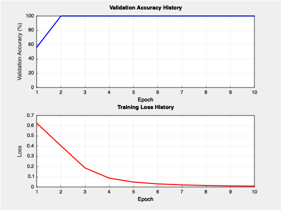
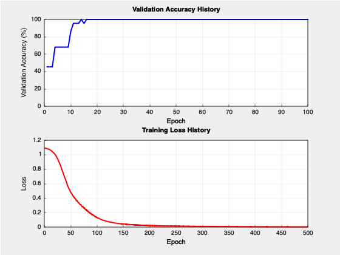

# Needle

A Lightweight Neural Network Library for Learning and Prototyping


## Overview

Needle is a minimalist C++ neural network library designed for educational purposes and rapid prototyping. It features automatic differentiation, customizable network architectures, and ready-to-use classification models.

## Features

- **Automatic Differentiation Engine**: Expression-tree based gradient computation
- **Flexible Architecture**: Build custom Multi-Layer Perceptrons with ease
- **Pre-built Models**: Binary and multi-class classifiers ready to use
- **Model Persistence**: Save and load trained models
- **Optimization**: Stochastic Gradient Descent (SGD) optimizer
- **Activation Functions**: ReLU, Sigmoid, Softmax, and Linear
- **Loss Functions**: Binary and Categorical Cross-Entropy
- **Testing Suite**: Comprehensive unit and integration tests

## Installation

### Requirements

- CMake 3.29 or higher
- C++14 compatible compiler
- GoogleTest (automatically fetched by CMake)

### Build Instructions

```bash
# Clone the repository
git clone https://github.com/yourusername/needle.git
cd needle

# Create build directory
mkdir build && cd build

# Configure and build
cmake ..
cmake --build .

# Run tests
./tests

# Make sure to install the following package that is needed 
# by the plotting library

# If you are on Linux(Debian/Ubuntu)
sudo apt update
sudo apt install gnuplot

# If you are on MacOS (using Homebrew)
brew install gnuplot
```

## Quick Start

### 1. Binary Classification

```cpp
#include <models/binaryClassifier.h>
#include <utils/datasets/xorDataset.h>

int main() {
    // Load dataset
    auto dataset = XORDataset::get_repeated(20);
    
    // Create model: 2 inputs, [8, 8] hidden layers
    BinaryClassifier model(2, {8, 8});
    
    // Train the model
    model.train(0.15, 1000, 1, dataset);
    
    // Make prediction
    std::vector<double> input = {1.0, 0.0};
    int prediction = model.predict(input);
    std::cout << "Prediction: " << prediction << std::endl;
    
    return 0;
}
```

### Training Results



### 2. Multi-Class Classification

```cpp
#include <models/multiClassClassifier.h>
#include <utils/datasets/irisDataset.h>

int main() {
    // Load Iris dataset
    auto dataset = IrisDataset::get_repeated(5);
    
    // Create model: 4 inputs, [8, 8] hidden layers, 3 output classes
    MultiClassClassifier model(
        IrisDataset::get_num_features(),
        {8, 8},
        IrisDataset::get_num_classes()
    );
    
    // Train the model
    model.train(0.1, 500, 100, dataset);
    
    // Make prediction
    std::vector<double> input = {0.22, 0.63, 0.07, 0.04};
    int predictedClass = model.predict(input);
    std::cout << "Predicted class: " << predictedClass << std::endl;
    
    return 0;
}
```
### Training Results



## Core Concepts

### Network Architecture

Networks in Needle are defined by specifying:
- **Input size**: Number of features in your data
- **Hidden layers**: Vector of integers representing neurons per layer
- **Output size**: Number of classes (for multi-class) or 1 (for binary)

Example architectures:
```cpp
// Binary classification: 2 inputs → 4 hidden → 4 hidden → 1 output
BinaryClassifier model(2, {4, 4});

// Multi-class: 4 inputs → 8 hidden → 8 hidden → 3 outputs
MultiClassClassifier model(4, {8, 8}, 3);
```

### Training Parameters

```cpp
model.train(learningRate, epochs, batchSize, dataset);
```

- **learningRate**: Controls step size during optimization (typical: 0.001 - 0.1)
- **epochs**: Number of complete passes through the dataset
- **batchSize**: Number of samples before parameter update
- **dataset**: Vector of (input_vector, label) pairs

### Data Format

Datasets should be formatted as:
```cpp
std::vector<std::pair<std::vector<double>, double>> dataset;
// Each pair: ({features...}, label)
```

## Model Persistence

### Saving a Model

```cpp
// Train your model
MultiClassClassifier model(4, {8, 8}, 3);
model.train(0.1, 500, 100, dataset);

// Save to file
model.saveModel("my_model.txt");
```

The saved file contains:
- Network architecture (layer sizes)
- All trained parameters (weights and biases)
- Metadata for validation

### Loading a Model

```cpp
// Load a pre-trained model
MultiClassClassifier* model = MultiClassClassifier::loadFromFile("my_model.txt");

if (model != nullptr) {
    // Use the model for predictions
    std::vector<double> input = {0.5, 0.3, 0.8, 0.2};
    int prediction = model->predict(input);
    
    // Clean up
    delete model;
}
```

## Advanced Usage

### Custom Network Architecture

For more control, extend the `Network` class:

```cpp
class CustomNetwork : public Network {
public:
    CustomNetwork(int inputs, std::vector<int> hiddenLayers) 
        : Network(buildSpecs(inputs, hiddenLayers)) {}
    
    static std::vector<std::pair<int, Activation>> buildSpecs(
        int inputs, 
        const std::vector<int>& hiddenLayers
    ) {
        std::vector<std::pair<int, Activation>> specs;
        specs.emplace_back(inputs, Activation::INPUT);
        
        for (int size : hiddenLayers) {
            specs.emplace_back(size, Activation::RELU);
        }
        
        specs.emplace_back(1, Activation::SIGMOID);
        return specs;
    }
    
    // Implement required virtual methods...
};
```

### Access Model Parameters

```cpp
// Get all network parameters (weights and biases)
std::vector<Node*> params = model.parameters();

// Inspect parameter values
for (Node* param : params) {
    std::cout << "Value: " << param->data 
              << ", Gradient: " << param->grad << std::endl;
}
```

### Manual Forward Pass

```cpp
// Create input nodes
std::vector<Node*> inputNodes;
for (double val : inputVector) {
    inputNodes.push_back(new Node(val));
}

// Forward pass
std::vector<Node*> outputs = model(inputNodes);

// Access output values
for (Node* output : outputs) {
    std::cout << "Output: " << output->data << std::endl;
}

// Clean up
for (Node* node : inputNodes) delete node;
```

## Dataset Utilities

### Built-in Datasets

#### XOR Dataset
```cpp
auto data = XORDataset::get_data();        // Get once
auto repeated = XORDataset::get_repeated(10);  // Repeat 10 times
```

#### Iris Dataset
```cpp
auto data = IrisDataset::get_data();
auto repeated = IrisDataset::get_repeated(5);

int numFeatures = IrisDataset::get_num_features();  // 4
int numClasses = IrisDataset::get_num_classes();    // 3
```

### Creating Custom Datasets

```cpp
std::vector<std::pair<std::vector<double>, double>> myDataset;

// Add samples: (features, label)
myDataset.push_back({{1.0, 2.0, 3.0}, 0.0});  // Class 0
myDataset.push_back({{4.0, 5.0, 6.0}, 1.0});  // Class 1
myDataset.push_back({{7.0, 8.0, 9.0}, 2.0});  // Class 2
```

## Auto-Differentiation Engine

The `Node` class provides automatic gradient computation:

```cpp
// Create nodes
Node x(3.0);
Node y(4.0);

// Build computation graph
Node* z = x * y;           // z = 3 * 4 = 12
Node* w = z->pow(2.0);     // w = 12^2 = 144

// Compute gradients
w->backward();

// Access gradients
std::cout << "dw/dx: " << x.grad << std::endl;  // 96
std::cout << "dw/dy: " << y.grad << std::endl;  // 72
```

Supported operations:
- Addition: `a + b`
- Multiplication: `a * b`
- Division: `a / b`
- Power: `a.pow(n)`
- Logarithm: `Node::logNode(&a)`

## Testing

Run the comprehensive test suite:

```bash
cd build
./tests
```

Test categories:
- **Unit Tests**: AutoGrad engine, activations, loss functions
- **Integration Tests**: Full model training and prediction
- **Robustness Tests**: Edge cases and error handling

## Architecture Details

### Project Structure

```
needle/
├── autoGradEngine/       # Automatic differentiation
│   └── node.h
├── nnComponents/         # Neural network components
│   ├── activations/      # Activation functions
│   ├── lossFunctions/    # Loss computations
│   ├── optimizers/       # SGD optimizer
│   ├── trainers/         # Training loop
│   ├── layer.h
│   ├── module.h
│   ├── network.h
│   └── neuron.h
├── models/               # Pre-built model templates
│   ├── binaryClassifier.h
│   └── multiClassClassifier.h
├── utils/                # Helper utilities
│   ├── datasets/         # Sample datasets
│   ├── serialization/    # Model save/load
│   └── randomGenerators/ # Weight initialization
└── tests/                # Test suite
```

### Key Classes

- **Node**: Auto-differentiation engine core
- **Neuron**: Basic computational unit
- **Layer**: Collection of neurons
- **Network**: Multi-layer perceptron base class
- **Trainer**: Training loop and optimization
- **ModelSerializer**: Save/load functionality

## Limitations

- **CPU Only**: No GPU acceleration
- **Dense Networks**: Only fully-connected layers
- **Single Optimizer**: Only SGD available
- **Memory**: Manual memory management required for advanced usage

## License

This project is licensed under the MIT License - see the [LICENSE](LICENSE) file for details.